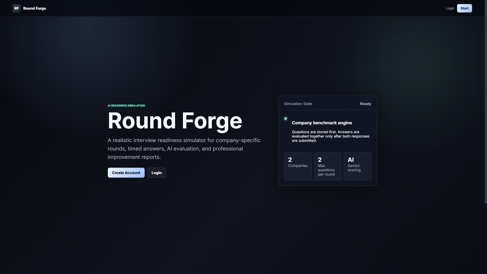
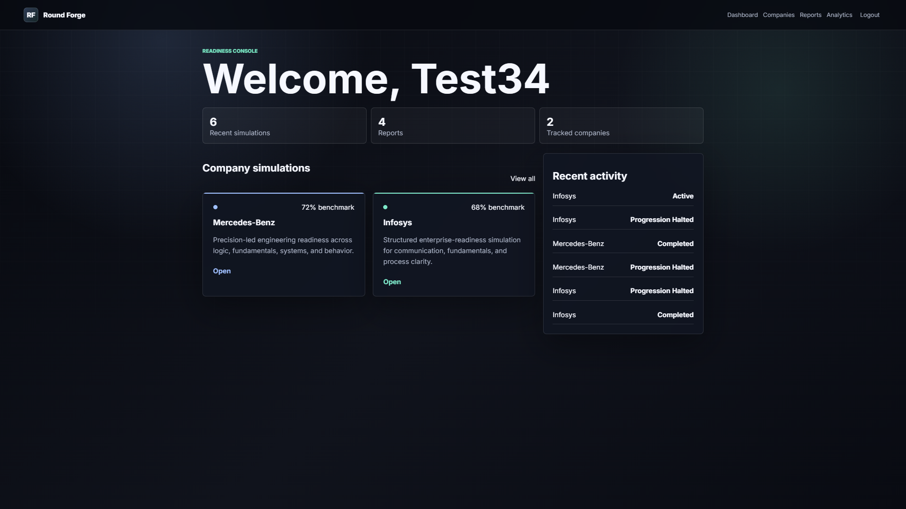
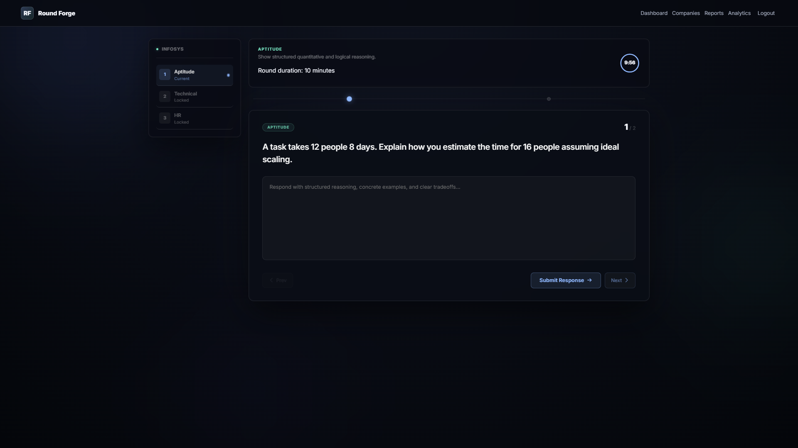
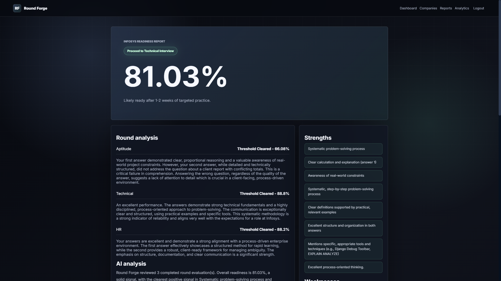

# RoundForge

RoundForge is an AI-powered interview simulation platform built with Django.The platform simulates structured interview workflows inspired by real company evaluation patterns across aptitude, technical, system design, and behavioral rounds. It combines AI-assisted scoring, progression logic, readiness reporting, and fallback evaluation systems to maintain uninterrupted interview simulations.

## Project Overview

RoundForge provides structured company-specific interview workflows with timed rounds, AI evaluation, progression control, and readiness reporting. Users select a company, answer timed round questions, receive pass/fail decisions based on configured thresholds, and get a final report after completion or progression halt.

This project is designed as an interview readiness tool, not a hiring or recruitment system.

## Screenshots

### Landing Page


### Dashboard


### Interview Simulation


### Final Readiness Report


## Features

- Multi-round interview simulation
- Company-specific interview flows
- AI evaluation using Gemini API
- Round progression logic
- Pass/fail threshold system
- AI-generated final readiness report
- Strengths, weaknesses, and roadmap generation
- Fallback local evaluation when Gemini API is unavailable
- Interactive modern UI with modal-based round transitions

## Workflow

```text
Company Selection
    -> Multi-Round Interview
    -> AI Evaluation
    -> Pass/Fail Logic
    -> Final Report
```

1. The user selects a company simulation.
2. The platform starts a multi-round interview flow.
3. Answers are submitted and evaluated after the required responses are collected.
4. Gemini evaluates the round against company-specific expectations.
5. Passing unlocks the next round.
6. Failing halts progression and generates a report.
7. Completing all rounds generates a final readiness report.

## Tech Stack

### Backend
- Django
- Django ORM
- SQLite

### Frontend
- HTML
- CSS
- JavaScript

### AI Integration
- Gemini API
- Gemini 2.5 pro

### System Features
- Session-based progression engine
- AI-assisted evaluation pipeline
- Responsive grid-based UI
- Fallback local scoring system

## Installation

1. Clone the repository.

```bash
git clone https://github.com/shantanu-hack/Round_Forge.git
cd Round_Forge
```

2. Create and activate a virtual environment.

```bash
python -m venv venv
venv\Scripts\activate
```

3. Install dependencies.

```bash
pip install -r requirements.txt
```

4. Create a `.env` file from the example file.

```bash
copy .env.example .env
```

5. Add your environment values.

```env
SECRET_KEY=your-secret-key
DEBUG=True
GEMINI_API_KEY=your-gemini-api-key
```

6. Run migrations.

```bash
python manage.py migrate
```

7. Seed the default company and round data.

```bash
python manage.py seed_roundforge
```

8. Start the development server.

```bash
python manage.py runserver
```

Open the app at:

```text
http://127.0.0.1:8000/
```

## Usage

1. Register or log in.
2. Select a company from the dashboard.
3. Start the interview simulation.
4. Answer the round questions.
5. Continue through unlocked rounds after passing.
6. Review the final readiness report.

## Fallback Evaluation System

RoundForge uses Gemini API for AI evaluation. If the Gemini API key is missing, invalid, or the API request fails, the platform uses a local fallback evaluator.

The fallback system keeps the simulation usable by generating a basic score, decision, feedback, strengths, weaknesses, and roadmap without stopping the interview flow.

## Future Improvements

- More company templates
- Better report export options
- User performance trends over time
- More detailed question banks
- Resume-based simulation customization
- Optional voice-based interview practice

## Deployment Notes

This project is configured for local development and can be deployed on platforms such as Render, Railway, or VPS-based environments with environment variable support.

## Author

**Shantanu S Joshi**

GitHub: https://github.com/shantanu-hack
